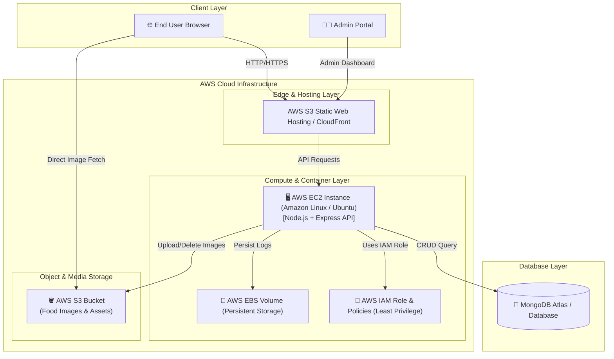

# ☁️ FoodieSpot - AWS Cloud Architecture & Infrastructure Guide

This document provides a detailed walkthrough of the **AWS Cloud Architecture** implemented in the **FoodieSpot** Full-Stack Web Application for the **PluginHive** technical evaluation.

---

## 🏗️ AWS Cloud System Architecture

The following diagram illustrates how the **React.js Frontend**, **Node.js Express Backend**, **AWS S3 Storage**, **AWS IAM Policies**, and **AWS EC2/EBS** interact:



---

## 🔑 AWS Services Breakdown

| AWS Service | Integration Purpose | Details |
|---|---|---|
| **AWS S3 (Simple Storage Service)** | Cloud Media Storage | Food images are streamed buffer-by-buffer via `@aws-sdk/client-s3` directly to S3 bucket `foodiespot-media-bucket`. Supports public read access & auto deletion when items are removed. |
| **AWS EC2 (Elastic Compute Cloud)** | Server Runtime | Hosts the Node.js Express REST API server containerized with Docker or managed via PM2. |
| **AWS EBS (Elastic Block Store)** | Block Storage | Attached block storage volume mounted at `/mnt/ebs-data` for database logs, cache, and backup retention across instance reboots. |
| **AWS IAM (Identity & Access Management)** | Security & Policy | Least-privilege IAM policies (`aws/iam-policy-s3.json`) granting only specific S3 permissions (`PutObject`, `GetObject`, `DeleteObject`, `ListBucket`) to the server role. |

---

## 🛠️ Step-by-Step AWS Setup Instructions

### 1. AWS S3 Bucket Setup
1. Go to **AWS S3 Console** -> **Create Bucket**.
2. Name: `foodiespot-media-bucket` (or your preferred unique name).
3. Select Region (e.g., `us-east-1`).
4. Apply the Bucket Policy from [`aws/s3-bucket-policy.json`](./aws/s3-bucket-policy.json):
   ```json
   {
     "Version": "2012-10-17",
     "Statement": [
       {
         "Sid": "PublicReadGetObject",
         "Effect": "Allow",
         "Principal": "*",
         "Action": "s3:GetObject",
         "Resource": "arn:aws:s3:::foodiespot-media-bucket/food-images/*"
       }
     ]
   }
   ```

### 2. AWS IAM User / Role Setup
1. Go to **AWS IAM Console** -> **Policies** -> **Create Policy**.
2. Import JSON policy from [`aws/iam-policy-s3.json`](./aws/iam-policy-s3.json).
3. Attach this policy to your **IAM User** (for Access Keys) or **EC2 IAM Role**.
4. Generate `AWS_ACCESS_KEY_ID` and `AWS_SECRET_ACCESS_KEY`.

### 3. AWS EC2 Instance Deployment
1. Launch an `t2.micro` or `t3.micro` EC2 Instance running **Amazon Linux 2023** or **Ubuntu 22.04 LTS**.
2. Configure **Security Group** inbound rules:
   - Port 22 (SSH)
   - Port 80 (HTTP)
   - Port 443 (HTTPS)
   - Port 4000 (Node.js API)
3. SSH into EC2 and run the automated deployment script:
   ```bash
   chmod +x aws/deploy-ec2.sh
   ./aws/deploy-ec2.sh
   ```

---

## 🧪 AWS Health Verification Endpoint

The server includes a dedicated status route to verify AWS S3 credentials and operational state:

```http
GET /api/aws/status
```

**Response Example (AWS Activated)**:
```json
{
  "success": true,
  "aws": {
    "service": "AWS S3 Image Storage Service",
    "configured": true,
    "mode": "AWS S3 Cloud Mode",
    "region": "us-east-1",
    "bucketName": "foodiespot-media-bucket",
    "features": [
      "AWS S3 Direct Multipart Uploads",
      "Automatic Image Clean-up on Delete",
      "Least-Privilege IAM Policy Integration",
      "AWS EC2 Deployment Support",
      "AWS EBS Persistent Logs Support"
    ]
  }
}
```
